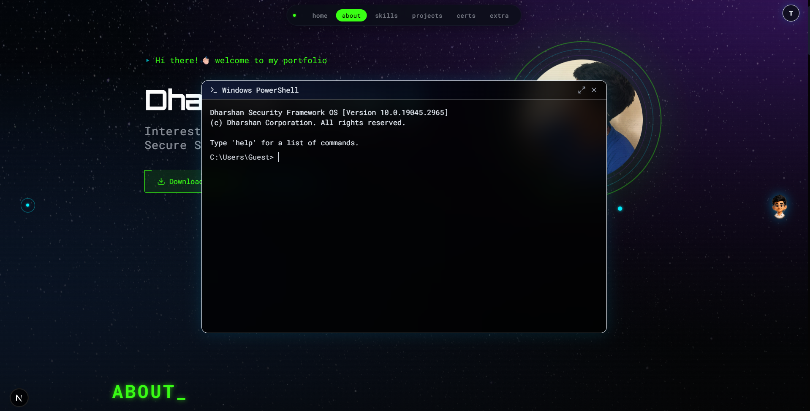
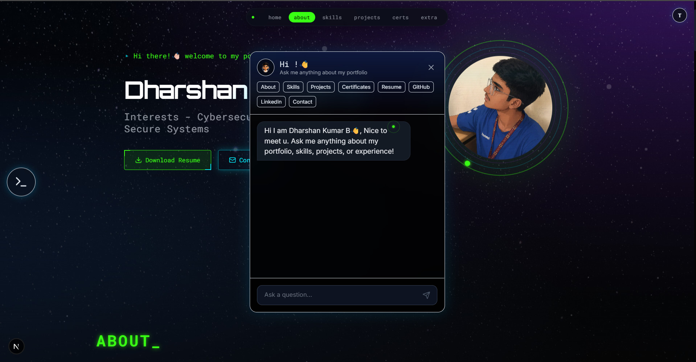

# Dharshan Kumar B - Cybersecurity Portfolio

You can go to the live page by using this URL: [dharshankumarb.vercel.app](https://dharshankumarb.vercel.app)

## Overview
A highly responsive professional developer and cybersecurity portfolio built with a state-of-the-art cyberpunk aesthetic, interactive console terminal, and secure dynamic management console.

## Tools & Technologies Used
* **Framework:** Next.js (App Router)
* **Styling:** Tailwind CSS & Vanilla CSS
* **Animations:** Framer Motion
* **Database & Storage:** Supabase
* **Icons:** Lucide React & React Icons

## Features & Walkthrough

### Home Page: Terminal and AI Access
The home page provides interactive access points to both the terminal (left) and the AI assistant (right).

### Interactive Terminal
Dive into the cyberpunk-themed interactive console terminal to explore the portfolio like a hacker.

You can use commands to navigate. For example, running `help` or `info` displays available commands and sections.

You can also view the projects directly from the terminal interface.

### AI Assistant
The home page also features an integrated AI assistant to help you navigate and answer questions about the portfolio.

Interact with the assistant directly through its intuitive chat interface.

### Global Navigation
For a traditional browsing experience, use the global navigation bar located at the top of the screen.

## Local Setup
1. `npm install`
2. Create a `.env` file with your Supabase keys (`NEXT_PUBLIC_SUPABASE_URL`, `NEXT_PUBLIC_SUPABASE_PUBLISHABLE_KEY`, `SUPABASE_SERVICE_ROLE_KEY`).
3. `npm run dev`
